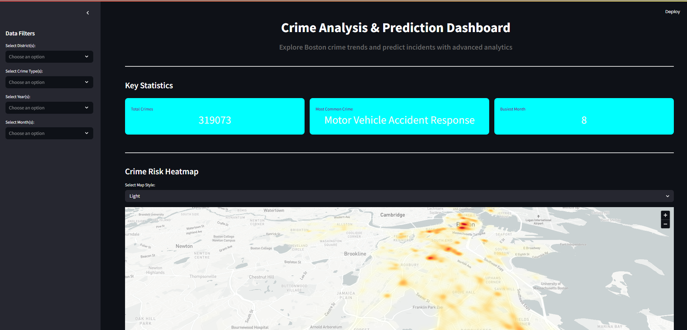

# Rakshekanetra: Smart Crime Analytics Dashboard

**Rakshekanetra** is a real-time crime analytics and prediction dashboard designed to empower law enforcement with data-driven insights. Built during a hackathon for the **Karnataka Police**, this project leverages machine learning, interactive visualizations, and real-time mapping to support smart policing and proactive crime prevention.

---

## Features

* **Crime Trend Analysis**
  Analyze historical crime data to uncover emerging patterns using ML models.

* **Predictive Analytics**
  Identify future crime hotspots based on time, location, and past incident trends.

* **Real-time Mapping**
  Visualize incidents spatially using the Google Maps API for better decision-making.

* **Smart Dashboard Interface**
  Designed for both field officers and command staff, the dashboard is responsive and user-friendly.

* **Interactive UI with Streamlit**
  Dynamic filtering, visualization toggles, and user-driven data exploration.

---

## Tech Stack

| Layer         | Technology Used             |
| ------------- | --------------------------- |
| Frontend      | Streamlit                   |
| Backend       | Python                      |
| Mapping       | Google Maps API             |
| ML & Data     | scikit-learn, pandas, numpy |
| Visualization | Plotly, Streamlit Charts    |

---

## Screenshot



---

## Getting Started

To run this project locally:

1. **Clone the Repository**

   ```bash
   git clone https://github.com/shreyas27092004/crime-rate-prediction.git
   cd crime-rate-prediction
   ```

2. **Install Dependencies**

   Create a virtual environment and install required packages:

   ```bash
   python -m venv venv
   source venv/bin/activate        # On Windows: venv\Scripts\activate
   pip install -r requirements.txt
   ```

3. **Add API Key**

   Create a `.env` file (or use `secrets.toml` if using Streamlit secrets):

   ```
   GOOGLE_MAPS_API_KEY=your_api_key_here
   ```

4. **Run the App**

   ```bash
   streamlit run app.py
   ```

---

## Contribution

This project was developed by **Shreyas V.** for the **Karnataka Police Hackathon 2025**.
Contributions, feedback, and feature suggestions are welcome.
Feel free to open an issue or submit a pull request.

---

## License

This project is open-source and available under the [MIT License](LICENSE).

---

## Contact

* Email: [shreyasshreyu405@gmail.com](mailto:shreyasshreyu405@gmail.com)
* GitHub: [shreyas27092004](https://github.com/shreyas27092004)
* College: Presidency University, Bangalore

---
